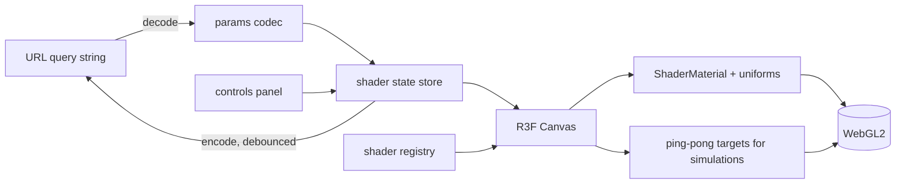

# Shader Garden - a gallery of live GPU shaders you can tune and share

> Status: draft v1 · Owner: Georges · Updated: 2026-10-09 · Domain: graphics / generative art · CV highlight: no · Language: TypeScript, GLSL · Hosting: Vercel mode A

## 1. Summary

Shader Garden is a static web gallery of hand-written GLSL shaders rendered with React Three Fiber. Each shader exposes its parameters as sliders, colour pickers and toggles; every parameter set is encoded in the URL so a view can be shared exactly. Two of the shaders are stateful simulations (reaction-diffusion and curl-noise fluid) driven by a ping-pong render-target loop. The project is the first in the weekend showcase series and the test case for the automated build, deploy and capture pipeline.

## 2. Goals and non-goals

**Goals**
- G1. Six shaders render at 60 fps on a 2020-class laptop GPU at 1080p (measured by the in-app frame-time meter).
- G2. Every parameter change is reflected in the URL within 250 ms, and opening that URL restores the identical view (same seed, same parameters).
- G3. A Playwright script records a 15-second 1080p video loop of the production site without manual steps.
- G4. Each shader page shows its GLSL source in a read-only viewer.

**Non-goals (v1)**
- A shader editor or live recompilation of user code.
- WebGPU; WebGL2 only.
- Mobile touch-optimized controls (pages must not break on mobile, but controls are desktop-first).
- Accounts, saving galleries, or any backend.

## 3. Users and demo story

Users: LinkedIn and portfolio visitors who open the link for under a minute; developers curious about shader techniques.

60-second demo script:
1. 0–10 s: the landing page shows a grid of six live thumbnails, all animating.
2. 10–25 s: the visitor opens "Terrain": a domain-warped noise landscape. They drag the "warp" slider; the terrain folds in real time.
3. 25–40 s: they open "Bloom" (reaction-diffusion), click "Seed" and watch coral-like patterns grow; they switch the preset from "Coral" to "Mitosis".
4. 40–50 s: they press "Randomize" on "Mandelbulb"; the fractal and palette change.
5. 50–60 s: they press "Copy link", open it in a new tab, and see the identical view.

## 4. Scope

**v1 (must)**
- Six shaders: Terrain (domain-warped fBm), Mandelbulb (raymarched), Bloom (Gray-Scott reaction-diffusion), Ink (curl-noise advected dye), Aurora (layered noise ribbons), Moiré (interference patterns).
- Gallery grid with live thumbnails (paused when off-screen).
- Per-shader controls panel, presets, "Randomize", "Copy link".
- URL parameter codec with versioning.
- GLSL source viewer.
- Frame-time meter (toggle with `F`).
- Playwright capture script producing `demo.webm` and `demo.png`.

**v1.1 (should)**
- Mouse interaction for Ink (drag to inject dye).
- Export a still frame as PNG at 4K.
- Two more shaders (Voronoi crystals, Julia set morph).

## 5. Architecture



Repository layout:

```
shader-garden/
  src/
    app/            routes (gallery, shader page), layout
    shaders/
      <name>/       <name>.frag.glsl, <name>.vert.glsl (when needed), meta.ts (params, presets)
      common/       noise.glsl, palette.glsl, sdf.glsl
    engine/         ShaderView, PingPong, uniforms binding, frame meter
    params/         codec.ts, schema.ts, random.ts
    ui/             controls panel, gallery grid, source viewer
  scripts/
    capture.ts      Playwright video and screenshot recorder
    shaders-check.ts compiles every shader headlessly
  e2e/              Playwright tests (@smoke subset)
  test/             unit and property tests
  docs/
```

## 6. Core algorithms and design decisions

**Hand-written core**
- Every GLSL shader, including the shared `noise.glsl` (simplex and value noise, fBm), `sdf.glsl` and `palette.glsl` (cosine palettes).
- The ping-pong render-target loop (`PingPong`) for stateful simulations.
- The URL parameter codec and the seeded random generator for "Randomize".

**Allowed libraries:** `react`, `react-dom`, `three`, `@react-three/fiber`, `@react-three/drei` (only `useFBO` and `PerformanceMonitor`), `zustand`, `react-router`, `zod`, `shiki` (source viewer). Development: Vite, Vitest, fast-check, Playwright, Biome, `vite-plugin-glsl`.

**Key decisions**
- *Shader metadata as data.* Each `meta.ts` declares parameters (`name`, `type`, `min`, `max`, `step`, `default`), presets and the uniform mapping. The controls panel and codec are generated from it; no per-shader UI code.
- *Codec.* Query string `?v=1&s=<seed>&p=<base64url of packed values>`. Values are quantized to each parameter's `step` and packed in declaration order, so URLs stay under 200 characters. Unknown versions fall back to defaults with a toast.
- *Reaction-diffusion.* Gray-Scott on a 512×512 float texture (`RGBA16F`), 8 simulation steps per frame, Laplacian with a 3×3 kernel, presets stored as (feed, kill) pairs.
- *Ink.* Semi-Lagrangian advection of a dye texture by a curl-noise velocity field; no pressure solve in v1.
- *Mandelbulb.* Sphere-traced distance estimator, power parameter 2–12, 128 steps max, soft shadows and ambient occlusion approximated from the step count.
- *Thumbnails.* One shared offscreen renderer draws thumbnails at 256 px, at 15 fps, only for tiles in view (IntersectionObserver).
- *Determinism.* Time uniform is driven by a clock that the capture script can freeze or step, so captures are reproducible.

## 7. Interfaces

**Web pages**
- `/` gallery grid.
- `/s/:name` shader page with canvas, controls panel, presets, "Randomize", "Copy link", "Source" tab.
- `/about` short explanation of each technique.

**Keyboard:** `F` frame meter, `R` randomize, `Space` pause, `S` toggle source.

**Scripts:** `pnpm capture -- --url <url> --shader <name> --seconds 15` writes `artifacts/demo.webm` and `artifacts/demo.png`.

**Visual identity:** dark "night garden" theme: near-black green background (`#0b1210`), a single phosphor-green accent (`#7cf2a4`), controls as thin glass panels floating over a full-bleed canvas. Typography: IBM Plex Mono for labels and values, Instrument Serif for the title. Gallery tiles have no borders; the shader is the frame.

## 8. Data model and storage

No database. All content is static: shader sources and metadata are bundled at build time, and state lives in the URL.

## 9. Development plan

| Milestone | Stack of PRs | Acceptance criteria |
| --- | --- | --- |
| M0 Scaffold | Vite + React + TS + Biome + Vitest; Playwright with one empty `@smoke` test; `ci.yml`; `smoke.yml`; `pr-meme.yml` caller from `docs/ENGINEERING.md` section 14 (action provided by `portfolio-infra`, tag `v1`); Vercel project linked | `pnpm check` green in CI; preview URL commented on the PR |
| M1 Engine | `ShaderView` with uniforms binding; deterministic clock; `PingPong`; frame meter | Unit tests for uniform binding and clock; a test shader renders in `shaders:check` |
| M2 Params | param schema; codec with versioning; seeded random; zustand store; URL sync | Property tests P1–P3 pass; URL updates within 250 ms in e2e |
| M3 Shaders | one PR per shader (six PRs) with `meta.ts` and presets | Each shader compiles in `shaders:check`; golden screenshot per shader at a fixed seed and time |
| M4 UI and identity | gallery grid with thumbnails; controls panel; source viewer; theme | E2E journeys J1–J3 pass; Lighthouse accessibility at least 90 |
| M5 Performance | thumbnail scheduler; resolution scaling via `PerformanceMonitor`; budgets check | Frame time at most 16.7 ms on the reference machine; initial JS within budget |
| M6 Capture | `scripts/capture.ts`; README GIF | `pnpm capture` produces a 15 s 1080p `.webm` and a `.png` from the production URL |
| M7 Ship | README, about page, production URL in uptime targets | Definition of done (section 15) complete |

## 10. Testing strategy

- **Unit:** codec encode/decode, quantization, schema validation, clock stepping, PingPong buffer swap.
- **Property (fast-check, seeded):**
  - P1 `decode(encode(params)) == quantize(params)` for any valid params.
  - P2 every encoded URL is at most 200 characters.
  - P3 `randomize(seed)` is deterministic and always within each parameter's bounds.
- **Golden:** one screenshot per shader at seed 1, time 2.0 s, 512×512, compared with a 1% pixel tolerance (headless Chromium with SwiftShader).
- **Shader compile check:** `pnpm shaders:check` compiles every shader in a headless WebGL2 context and fails on any error or warning.
- **End-to-end (Playwright):** J1 gallery loads and shows six animating tiles (`@smoke`); J2 slider change updates the URL and the canvas (`@smoke`); J3 copy link round-trip restores the view.
- **Performance:** frame-time sampling over 5 s per shader on CI is reported, not gated.
- **Coverage:** `src/params` and `src/engine` at least 90% of lines; repository at least 80%.

## 11. CI/CD

| Workflow | Purpose |
| --- | --- |
| `ci.yml` | Jobs `lint`, `typecheck`, `test`, `build`, `e2e` (includes `shaders:check` and golden screenshots) |
| `smoke.yml` | On successful Vercel deployment: `@smoke` journeys J1 and J2 against the deployed URL |
| `nightly.yml` | Long property runs (10,000 cases), `pnpm audit` |
| `pr-meme.yml` | standard caller from `docs/ENGINEERING.md` section 14, using `adam-riffi/portfolio-infra/actions/pr-meme@v1`; no secrets; never a required check |

No `release.yml`: nothing is published. Required checks: `lint`, `typecheck`, `test`, `build`, `e2e`.

## 12. Deployment and configuration

- Vercel project root: repository root; framework preset Vite; mode A (Git integration).
- No functions, so no region pin is needed; if a function is ever added, pin it to `cdg1`.
- Environment variables: none. `.env.example` is present and empty except for a comment.
- Secrets: none.
- Smoke checks after deploy: J1 and J2, plus `GET /` returns 200 and contains `Shader Garden`.
- Production URL to add to `portfolio-infra/uptime/targets.json`: `https://shader-garden.vercel.app` (or the URL Vercel assigns), expecting status 200 and body including `Shader Garden`.

## 13. Performance, security and observability

- Initial JavaScript at most 200 KB gzipped; `three` and shader pages are code-split per route.
- LCP at most 2.5 s on desktop broadband; 60 fps on the shader page at 1080p on the reference machine; the frame meter shows p95 frame time.
- Thumbnails capped at 15 fps and paused off-screen; simulation textures at most 512×512.
- Security headers via `vercel.json`: CSP (`default-src 'self'`, no inline scripts), `frame-ancestors 'none'`, `Referrer-Policy: strict-origin-when-cross-origin`, `X-Content-Type-Options: nosniff`.
- No user data collected; Vercel Web Analytics only.
- WebGL context loss is handled: an error state with a "Reload" button.

## 14. Risks and open questions

- Golden screenshots may differ between SwiftShader and real GPUs; mitigation: goldens run only in CI's headless Chromium.
- Float textures (`RGBA16F` render targets) may be unsupported on some mobile GPUs; fallback: show a static preview image for simulation shaders.
- Video capture quality in headless mode may be low; option: capture with `--use-gl=angle` or record frames and encode with ffmpeg.
- Open: final Vercel URL depends on name availability.

## 15. Definition of done

- [ ] Demo script in section 3 on the production URL.
- [ ] Six shaders shipped with presets, golden screenshots and source viewer.
- [ ] All required checks green on `main`; coverage thresholds met.
- [ ] `pnpm capture` produces the demo video and screenshot from production.
- [ ] Production URL added to `portfolio-infra/uptime/targets.json`.
- [ ] `pr-meme.yml` caller active on pull requests.
- [ ] README with live link, GIF, technique notes and run instructions.
